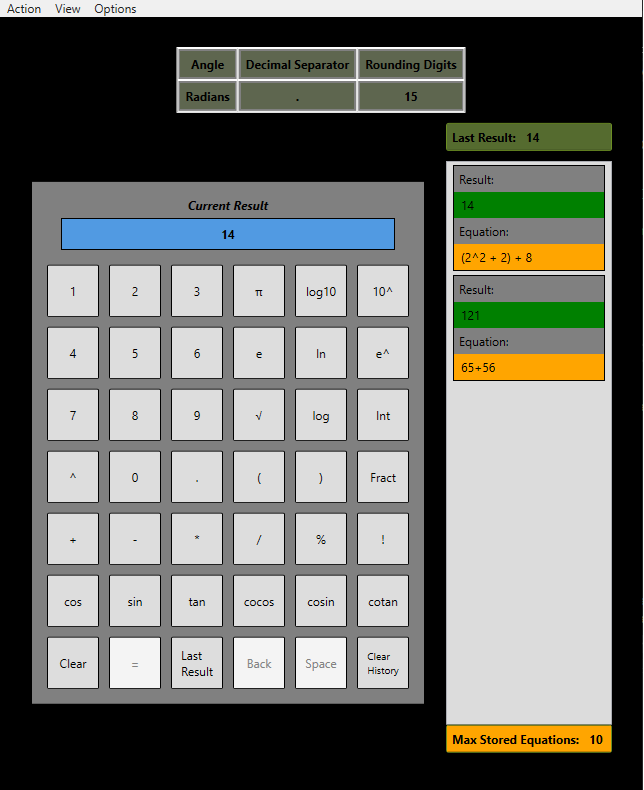

# Readme

## Development Environment

* C# 8.0 language features
* .Net CORE 3.1
* WPF as GUI framework
* xUnit as test framework for unit tests

## How to get and use the app

Download the zip file under the [Release](https://github.com/BoolPurist/SimpCalc/releases)  of this respo.
After unzipping the file, double click the executable to start the application.
The app is deployed for windows 64 os. It was tested under windows 10. No .Net Framework is needed to be installed to use it.

## How the app looks like in dark theme

## Feature list

* Numbers and operator can be entered directly into the calculator display by the keyboard or be inserted by clicking on the respective field in the calculator.
* If an equation has a mathematical or syntax error a respective error message is shown to the user.
* Calculation of an equation with its result is stored and shown to the user in the history list.
* Following operation can be used:
  * addition
  * substraction
  * multiplication
  * division
  * power
  * trigonometry functions like cos 
  * root
  * logarithm
  * faculty  
  * modular
* Following mathematical constants can be used
  * pi number
  * euler number
* Calculator can be configured in following terms
  * Rounding precision of a result.
  * If comma or point is used a decimal separator for a number
  * Maximum number of the last calculated equations shown to user
  * If degree or radians is used as angle in calculation
* Some widgets can be hidden or shown on demand
* Settings can be reset on demand
* Settings are preserved after closing the app
* Display of calculator can cleared via calculator button, clicking on the respective menu item or shortcut
* Can switch between dark and light theme
* History list can be cleared via calculator button, clicking on the respective menu item or shortcut
* Last result can be inserted in a current equation
